# Udacity project setup in Visual Studio with uWebSockets 

Udacity's [self driving car nanodegree](https://www.udacity.com/course/self-driving-car-engineer-nanodegree--nd013). There are several projects in Term2 and Term3 that use the [uWebSockets](https://github.com/uNetworking/uWebSockets) library:

- [CarND-Extended-Kalman-Filter-Project](https://github.com/udacity/CarND-Extended-Kalman-Filter-Project)
- [CarND-Unscented-Kalman-Filter-Project](https://github.com/udacity/CarND-Unscented-Kalman-Filter-Project)
- [CarND-Catch-Run-Away-Car-UKF](https://github.com/udacity/CarND-Catch-Run-Away-Car-UKF)
- [CarND-Kidnapped-Vehicle-Project](https://github.com/udacity/CarND-Kidnapped-Vehicle-Project)
- [CarND-PID-Control-Project](https://github.com/udacity/CarND-PID-Control-Project)
- [CarND-MPC-Project](https://github.com/udacity/CarND-MPC-Project)
- [CarND-Path-Planning-Project](https://github.com/udacity/CarND-Path-Planning-Project)

Visual Studio has [cmake](https://blogs.msdn.microsoft.com/vcblog/2016/10/05/cmake-support-in-visual-studio/) support, but I found working with the MS stack easier. It will take a couple minutes to set up a **Visual Studio** project, but it's worth it.
##### Requirements

- Visual Studio 2017 or Visual Studio 2015 Update 3

##### Install uWebSockets with vcpkg
[Vcpkg](https://github.com/Microsoft/vcpkg) is a tool to install C and C++ libraries. Visual Studio will find the installed libraries automatically, and uWebSockets is available through vcpkg.
Installing **vcpkg** is easy, the instructions from the [vcpkg github](https://github.com/Microsoft/vcpkg) project:

1. Clone the [vcpkg github repo](https://github.com/Microsoft/vcpkg) (in C:\src, but you can use whatever folder you want)
    <pre>`C:\src&gt; git clone https://github.com/Microsoft/vcpkg.git`</pre>

    Then run:   .\bootstrap-vcpkg.bat

1. Open a command prompt **as administrator** to hook up the integration (only need to do this once)
    <pre>`C:\src\vcpkg&gt; .\vcpkg integrate install`</pre>
1. Install uWebSockets (I chose the x64 version only)
    <pre>`C:\src\vcpkg&gt; .\vcpkg install uwebsockets:x64-windows`</pre>

##### Create VS project
Create an empty Visual C++ project in Visual Studio (**File → New → Project...**). I left **Create new Git repository** unchecked because the Udacity projects have their own git repos on github.
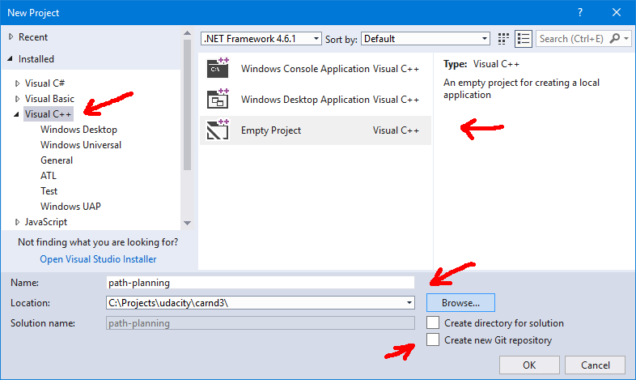
Close Visual Studio to make sure the project is saved.
Fork the Udacity project on [github](ttps://github.com/) (this is optional, but it's easiest to submit the finished project as a github repo).
For simplicity I'll just use the original [CarND-Path-Planning-Project](https://github.com/udacity/CarND-Path-Planning-Project) (without forking):
    C:\Projects\udacity\carnd3&gt; git clone https://github.com/udacity/CarND-Path-Planning-Project.git
Move the **Visual Studio** project and solution files into the cloned project folder:
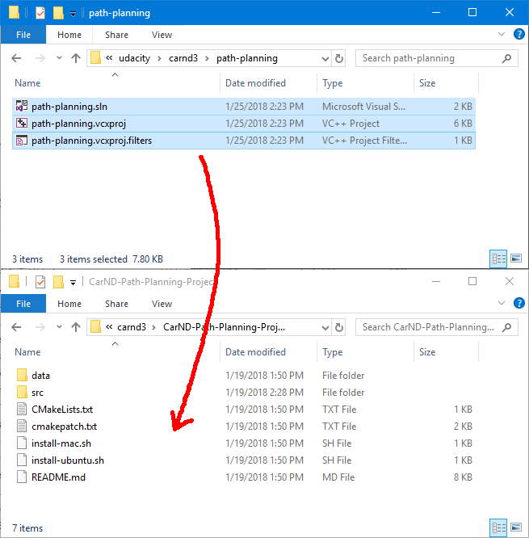
(At this point you can delete the now empty folder where the Visual Studio project was created.)
The project folder will look something like this:
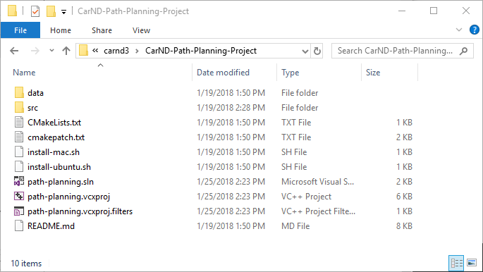
Open the Visual Studio solution by double clicking the **.sln** file. We'll add the **src** files to the solution next.
In the **Solution Explorer** right click **Source Files** and select **Add → Existing Item...** (or use the Shift+Alt+A shortcut):
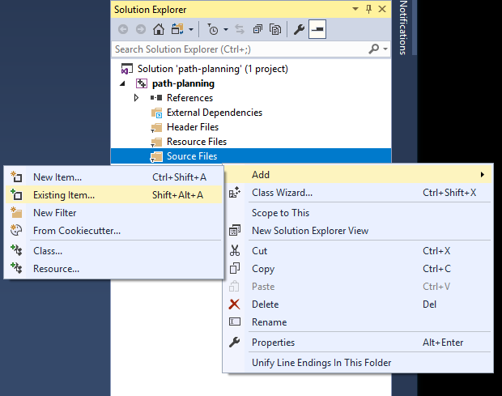
Add all source files from the **src** folder (don't add Eigen, we'll include that later):
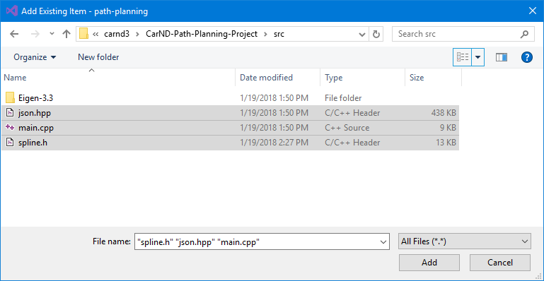
##### Fix uWebSockets version issues
Unfortunately [Udacity](https://www.udacity.com/) used an older version of **uWebSockets**. We need to change a couple things in **main.cpp** so it works with the latest version, while making sure that the code also compiles with the older version when the project is submitted for review. We'll do this with [preprocessor directives](http://www.cplusplus.com/doc/tutorial/preprocessor/).
First make sure that the **x64** platform is selected for the solution (if you don't have this setting on the toolbar, you can also change it in **Build → Configuration Manager → Active Solution Platform**):
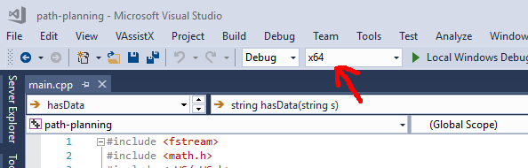
Select the project in the **Solution Explorer** (in this case **path-planning**) and open up its properties (right click → Properties or Alt+Enter). Make sure that **All Configurations** and **x64** are active. Go to **Configuration Properties → C/C++ → Preprocessor**. Add this to **Preprocessor Definitions** (don't delete what's already there, just paste in front or after):
    UWS_VCPKG;_USE_MATH_DEFINES;_CRT_SECURE_NO_WARNINGS;
Should look like this:
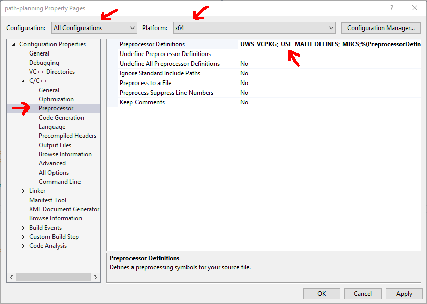
Note: We added **_USE_MATH_DEFINES** because **M_PI** is not defined by default. **_CRT_SECURE_NO_WARNINGS** disables errors about **sprintf** being unsecure.
If you build the project now, you'll see several errors. This is because in the latest **uWebSockets** version the server parameter (`uWS::WebSocket&lt;uWS::SERVER&gt; ws`) is a pointer. So we'll take the lines where it's used and put them into a preprocessor condition:
    #ifdef UWS_VCPKG
      // code fixed for latest uWebSockets
    #else
      // leave original code here
    #endif
For example:
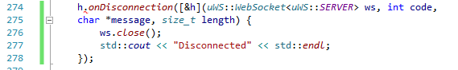
Will look like this (added * to make ws a pointer and changed . to -&gt;):
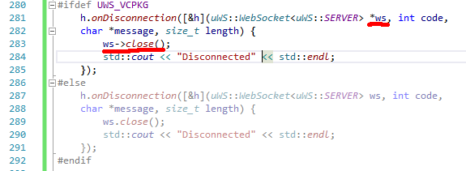
You can look at the whole fixed [main.cpp](https://www.codza.com/blog/udacity-uws-in-visualstudio/main.cpp.txt) file [here](https://www.codza.com/blog/udacity-uws-in-visualstudio/main.cpp.txt).

##### Eigen
If for some reason the **Eigen** headers are not found automatically, add the folder where it's located in the project's **Properties → Configuration Properties → C/C++ → General → Additional Include Directories** (in this case **src**):
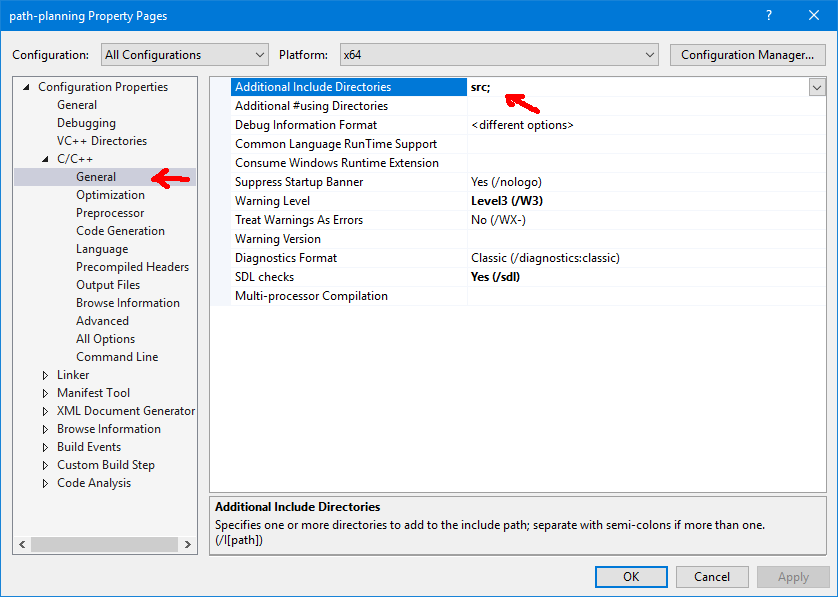
There is a custom view definition for Eigen objects so they look nice in Visual Studio's debugger. To install:

- get [Eigen.natvis](https://github.com/cdcseacave/Visual-Studio-Visualizers/blob/master/Eigen.natvis) from [this github page](https://github.com/cdcseacave/Visual-Studio-Visualizers/blob/master/Eigen.natvis) (right click on **Raw → Save link as...** ).
- copy it to the project's folder
- add as **Existing Item** to **Source Files** in the **Solution Explorer**

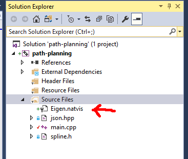

##### Fix simulator connection
One last thing: we have to tell **uWebSockets** to listen on **127.0.0.1**, otherwise the simulator won't connect.
Modify this line:
        if (h.listen(port)) {
to this:
        if (h.listen("127.0.0.1", port)) {
And that's it! You can now code in Visual Studio and the reviewer will be able to compile your submission using **cmake**. As long as you add new source files to the **src** folder, **cmake** will pick them up.
        
##### pch.h error

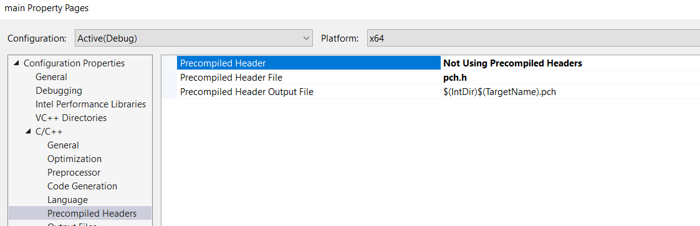